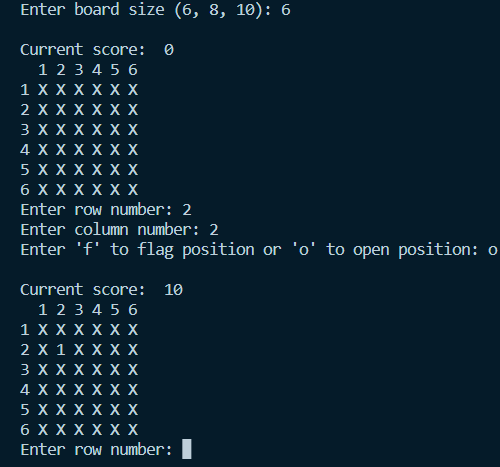
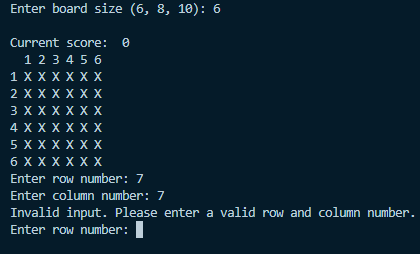
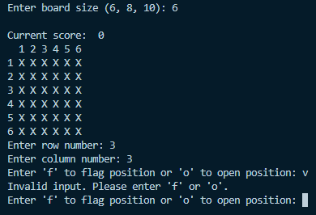
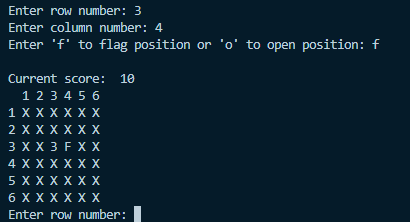

# Digital Design Worksheet 2


### Implemented simple version of Minesweeper, using the console


###### When the program is first run, the user is prompted to choose from one of 3 options for the size of the board
1. 6x6
2. 8x8
3. 10x10
* The user then enters the number of the row, then column, then 'F' or 'O' to either flag or open the cell as shown in the screenshot below
* Per Minesweeper rules, the cell selected by the user will display the amount of mines in a 1-cell proximity around it (in this case 1).


<hr>

###### As one of the main classes, the following 'Input' abstract class has been implemented to read input from the user

```
class Input(ABC):
    @abstractmethod
    def read(self):
        pass
```
###### In the instance the user enters an invalid row or column value, they would receive the following result and be asked to enter a valid value again


<hr>

###### In the instance the user enters an invalid character, anything other than 'F' or 'O', they would receive the following result and be asked to enter a valid character again


<hr>

###### In the instace where the user wanted to flag a certain cell, an 'F' will be in place of the X on the board as shown below


<hr>

###### In the instance where the user lost by landing on a mine, in the following two pictures, one will display the board printing all mines present on the board and the other picture showing a 'play again' prompt being used to play again

[!game loss](./game_loss.png)
[!play again](./play_again.png)
<hr>


